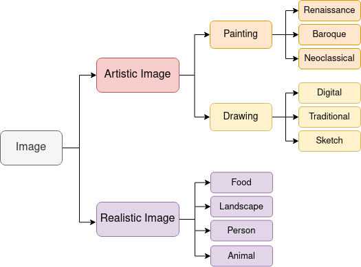

# TeTIm-Eval



Repository for the paper [TeTIm-Eval: a novel curated evaluation data set for comparing text-to-image models](https://arxiv.org/abs/2212.07839)

**You can find an online showcase of the dataset as well as the generated images from DALLE2, Stable Diffusion, Latent Diffusion, Craiyon and GLIDE [here](https://huggingface.co/spaces/galatolo/TeTIm-Eval-mini-showcase)**

You can browse the datasets samples on [🤗 Datasets](https://huggingface.co/datasets/galatolo/TeTIm-Eval)

## Usage

We uploaded our dataset to [🤗 Datasets](https://huggingface.co/datasets/galatolo/TeTIm-Eval) to use it install `datasets` and `Pillow`:

```
pip install datasets Pillow
```

To load the 300 text-image labelled pairs dataset:

```python
from datasets import load_dataset
ds = load_dataset("galatolo/TeTIm-Eval", "captioned")
```

To load the 2500 labelled images dataset:

```python
from datasets import load_dataset
ds = load_dataset("galatolo/TeTIm-Eval", "uncaptioned")
```

## Citing

The paper is currently under review
